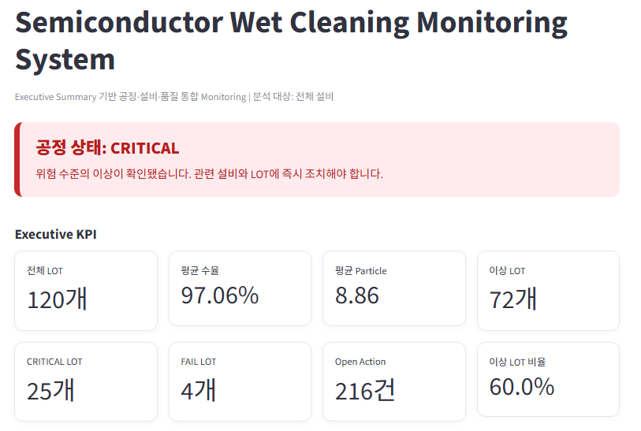
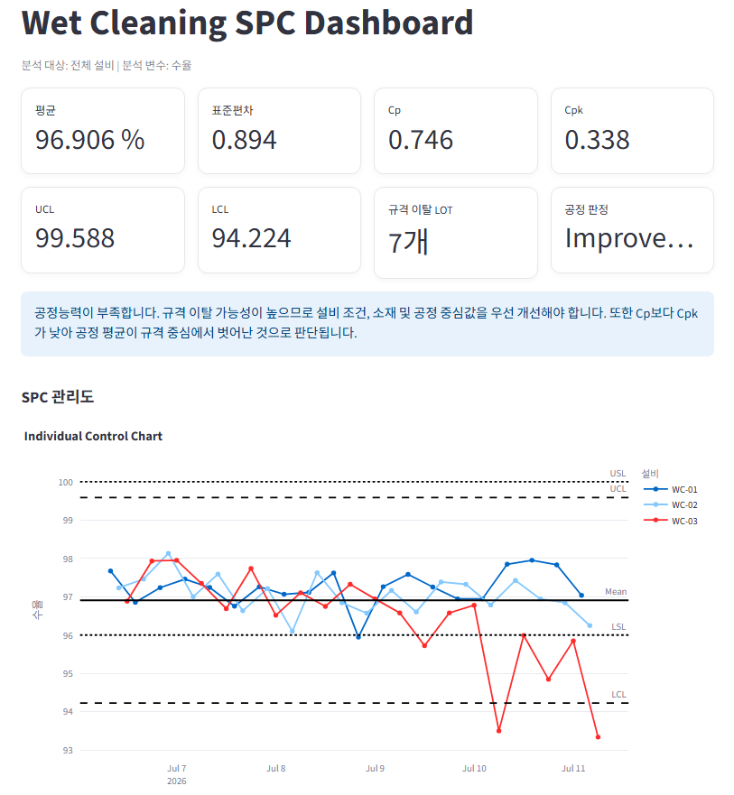
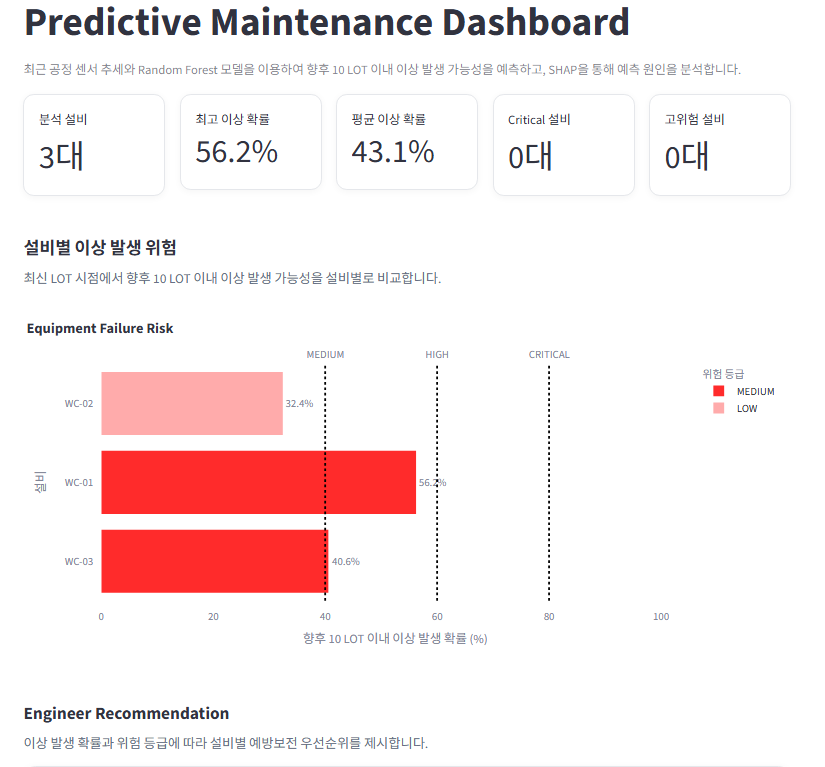
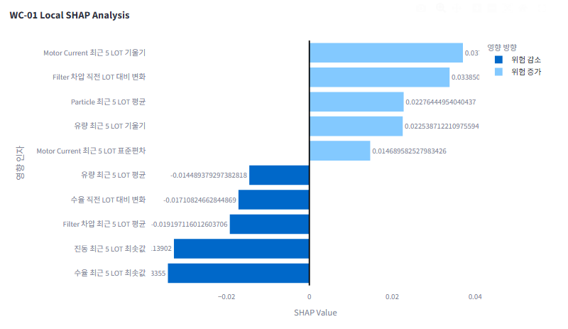
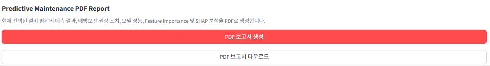
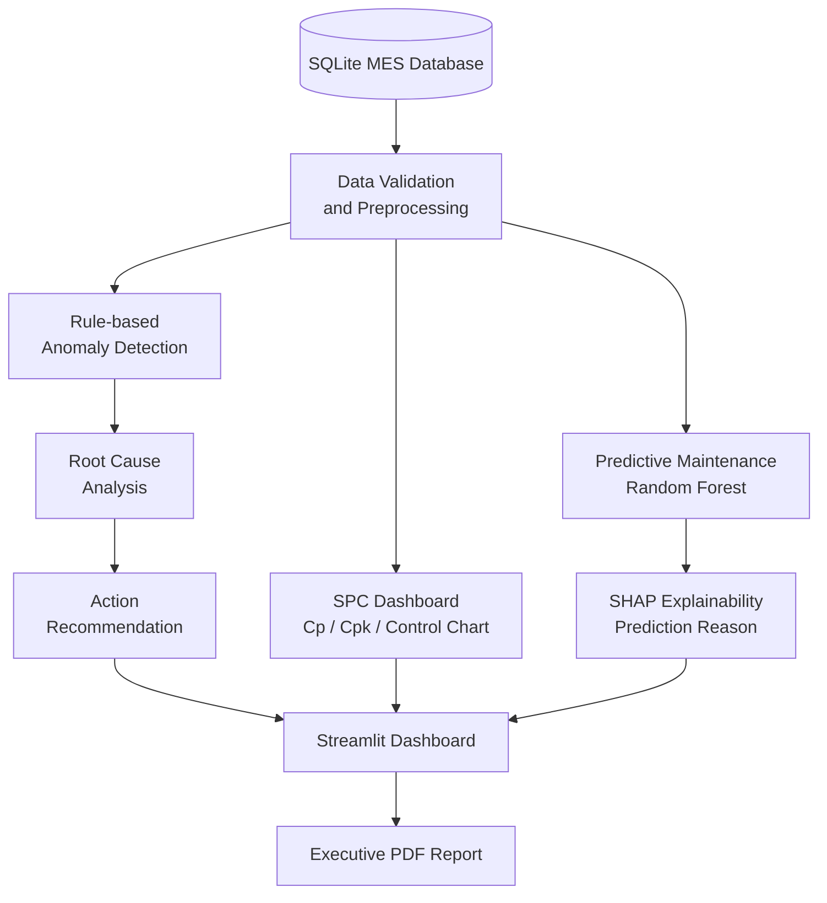

# Semiconductor Wet Cleaning Monitoring System

[](https://semiconductor-wet-cleaning-system.streamlit.app)

## 🚀 Live Demo

**👉 https://semiconductor-wet-cleaning-system.streamlit.app**

---

반도체 Wet Cleaning 공정의 MES 데이터를 기반으로...


반도체 Wet Cleaning 공정의 MES 데이터를 기반으로 공정 이상 감지, 원인 분석, 조치 추천, SPC 관리 및 설비 이상 예측을 수행하는 제조 데이터 분석 프로젝트입니다.

단순한 데이터 시각화가 아니라 다음과 같은 현업 분석 흐름을 하나의 시스템으로 구현했습니다.

## 📷 Dashboard Preview

### Main Dashboard



---

### SPC Dashboard



---

### Predictive Maintenance



---

### SHAP Explainability



---

### Executive PDF Report




---

## 1. Project Overview

Wet Cleaning 공정에서는 Particle, Filter 차압, 유량, Motor Current, 진동 및 수율 변화가 설비 이상과 품질 저하의 주요 신호가 될 수 있습니다.

본 프로젝트는 이러한 공정 데이터를 분석하여 다음 질문에 답하도록 설계했습니다.

- 현재 어떤 LOT와 설비에서 이상이 발생했는가?
- 어떤 공정 인자가 이상 판정에 영향을 주었는가?
- 엔지니어가 우선적으로 확인해야 할 항목은 무엇인가?
- 공정 평균과 변동은 관리 상태에 있는가?
- 향후 10 LOT 이내에 설비 이상이 발생할 가능성은 얼마인가?
- 머신러닝 모델이 해당 설비를 고위험으로 예측한 이유는 무엇인가?

---

## 2. Key Features

### Rule-based Anomaly Detection

설정된 관리 기준을 바탕으로 LOT별 공정 이상을 자동 감지합니다.

주요 감지 대상:

- Filter Differential Pressure
- Flow Rate
- Motor Current
- Vibration
- Particle Count
- Yield Percent

이상 수준은 다음과 같이 분류합니다.

```text
NORMAL
WARNING
CRITICAL
```

---

### Root Cause Analysis

이상 LOT의 센서 값과 관리 기준을 비교하여 가능한 원인을 분석합니다.

예시:

```text
Filter 차압 상승
→ Filter 막힘 또는 교체 주기 초과 가능성

Flow Rate 하락
→ Chemical 공급 불안정 또는 배관 막힘 가능성

Particle 증가
→ Chamber 오염 또는 세정 성능 저하 가능성
```

---

### Action Recommendation

이상 유형과 원인 분석 결과를 바탕으로 엔지니어 조치 방향을 생성합니다.

예시:

```text
Filter 차압과 Particle 증가가 동시에 확인됨
→ Filter 상태 점검
→ 교체 이력 확인
→ Chemical 공급 계통 점검
→ Dummy Cleaning 후 재측정
```

---

### SPC Dashboard

LOT 단위 공정 데이터를 이용하여 공정 평균, 산포 및 관리 상태를 분석합니다.

주요 지표:

- Mean
- Standard Deviation
- UCL
- LCL
- Cp
- Cpk
- Specification Violation
- Control Limit Violation

현재 데이터는 LOT 단위이므로 Individual Control Chart 방식으로 구현했습니다.

---

### Predictive Maintenance

최근 5개 LOT의 센서 추세를 Feature로 생성하고 Random Forest 모델을 이용해 향후 10 LOT 이내의 이상 발생 가능성을 예측합니다.

생성되는 주요 Feature:

```text
최근 5 LOT 평균
최근 5 LOT 표준편차
최근 5 LOT 최솟값
최근 5 LOT 최댓값
최근 5 LOT 기울기
직전 LOT 대비 변화량
```

예측 결과:

```text
Equipment: WC-03
Failure Probability: 87.4%
Risk Level: CRITICAL
```

위험 등급 기준:

| Risk Level | Failure Probability |
|---|---:|
| CRITICAL | 80% 이상 |
| HIGH | 60% 이상 |
| MEDIUM | 40% 이상 |
| LOW | 40% 미만 |

---

### SHAP Explainability

SHAP 분석을 통해 설비가 고위험으로 예측된 이유를 Feature 단위로 설명합니다.

예시:

```text
Filter 차압 최근 5 LOT 평균
→ 이상 발생 위험 증가

Particle 최근 5 LOT 평균
→ 이상 발생 위험 증가

유량 최근 5 LOT 기울기
→ 이상 발생 위험 증가
```

SHAP 값 해석:

```text
SHAP > 0
→ 이상 발생 확률을 높이는 방향

SHAP < 0
→ 이상 발생 확률을 낮추는 방향
```

SHAP 결과는 실제 인과관계의 확정이 아니라 모델 예측에 각 Feature가 기여한 방향을 의미합니다.

---

### Executive PDF Report

Dashboard 분석 결과를 경영진과 현업 엔지니어가 확인할 수 있도록 PDF Report로 생성합니다.

보고서 구성:

- Executive Summary
- 주요 KPI
- 이상 LOT 현황
- 설비별 공정 추세
- Root Cause Analysis
- Recommended Action
- AI Engineer Opinion
- 주요 확인 항목

---

## 3. Dashboard

Streamlit 기반으로 다음 페이지를 구성했습니다.

### Main Dashboard

- 주요 공정 KPI
- 최근 LOT 현황
- 이상 설비 현황
- 공정 Trend
- Root Cause
- Action Recommendation
- AI Engineer Opinion
- Executive PDF 다운로드

### SPC Dashboard

- 설비 및 공정 인자 선택
- Individual Control Chart
- Moving Average
- Capability Histogram
- Cp / Cpk
- 관리 이탈 LOT
- 공정 상태 해석

### Predictive Maintenance Dashboard

- 설비별 이상 발생 확률
- 위험 등급
- 예방보전 권장 조치
- Accuracy
- Precision
- Recall
- ROC-AUC
- Confusion Matrix
- Global Feature Importance
- Local SHAP Analysis
- AI Engineer Opinion

---

## 4. System Architecture

```text
semiconductor-wet-cleaning-monitoring/
│
├─ app.py
│
├─ pages/
│  ├─ 1_SPC_Dashboard.py
│  └─ 2_Predictive_Maintenance.py
│
├─ config/
│  └─ process_limits.yaml
│
├─ data/
│  ├─ raw/
│  ├─ processed/
│  │  ├─ predictive_maintenance_dataset.csv
│  │  ├─ predictive_maintenance_predictions.csv
│  │  └─ predictive_maintenance_shap.csv
│  └─ database/
│
├─ models/
│  └─ predictive_maintenance/
│     ├─ random_forest_model.joblib
│     ├─ feature_columns.json
│     ├─ model_metrics.json
│     └─ feature_importance.csv
│
├─ reports/
│
├─ src/
│  ├─ data_processing/
│  │  └─ analysis_repository.py
│  │
│  ├─ detection/
│  │  └─ rule_detector.py
│  │
│  ├─ recommendation/
│  │  └─ action_engine.py
│  │
│  ├─ reporting/
│  │  └─ executive_report.py
│  │
│  └─ predictive_maintenance/
│     ├─ __init__.py
│     ├─ feature_engineering.py
│     ├─ train_model.py
│     ├─ prediction_engine.py
│     └─ shap_explainer.py
│
├─ requirements.txt
└─ README.md
```

폴더 구조는 실제 프로젝트 상태에 따라 일부 다를 수 있습니다.

---

## 5. Technology Stack

### Language

- Python

### Data Processing

- Pandas
- NumPy

### Database

- SQLite

### Visualization

- Streamlit
- Plotly
- Matplotlib

### Machine Learning

- Scikit-learn
- Random Forest Classifier
- SHAP

### Reporting

- ReportLab

### Configuration

- YAML

### Version Control

- Git
- GitHub

---

## 6. Predictive Maintenance Pipeline

```text
SQLite MES Data
    ↓
Data Validation
    ↓
Equipment별 시간순 정렬
    ↓
Rolling Feature Engineering
    ↓
향후 10 LOT 이상 발생 Label 생성
    ↓
Train/Test Split
    ↓
Random Forest Training
    ↓
Model Evaluation
    ↓
설비별 최신 LOT Prediction
    ↓
SHAP Local Explanation
    ↓
Streamlit Dashboard
```

---

## 7. Model Features

모델은 다음 센서 항목의 최근 LOT 추세를 사용합니다.

```text
filter_differential_pressure
flow_rate
motor_current
vibration
particle_count
yield_percent
```

각 센서에서 다음 Feature를 생성합니다.

```text
_mean_5
_std_5
_min_5
_max_5
_slope_5
_change_1
```

예시:

```text
filter_differential_pressure_mean_5
filter_differential_pressure_slope_5
particle_count_std_5
flow_rate_change_1
```

---

## 8. Model Evaluation

모델은 다음 지표를 이용해 평가합니다.

### Accuracy

전체 예측 중 올바르게 예측한 비율입니다.

### Precision

이상이라고 예측한 데이터 중 실제 이상인 비율입니다.

### Recall

실제 이상 데이터 중 모델이 이상으로 찾아낸 비율입니다.

### ROC-AUC

정상과 이상을 구분하는 모델의 전반적인 분류 성능입니다.

예지보전에서는 실제 이상을 정상으로 잘못 판단하는 False Negative가 중요하므로 Accuracy뿐 아니라 Recall을 함께 확인해야 합니다.

---

## 9. Installation

프로젝트를 Clone합니다.

```bash
git clone <YOUR_GITHUB_REPOSITORY_URL>
```

프로젝트 폴더로 이동합니다.

```bash
cd semiconductor-wet-cleaning-monitoring
```

가상환경을 생성합니다.

```bash
python -m venv .venv
```

Windows PowerShell에서 가상환경을 활성화합니다.

```powershell
.\.venv\Scripts\Activate.ps1
```

필요한 패키지를 설치합니다.

```powershell
python -m pip install --upgrade pip
python -m pip install -r requirements.txt
```

---

## 10. Execution Order

처음 실행하는 경우 다음 순서대로 실행합니다.

### Step 1. Feature Engineering

```powershell
python -m src.predictive_maintenance.feature_engineering
```

생성 파일:

```text
data/processed/predictive_maintenance_dataset.csv
```

### Step 2. Model Training

```powershell
python -m src.predictive_maintenance.train_model
```

생성 파일:

```text
models/predictive_maintenance/random_forest_model.joblib
models/predictive_maintenance/feature_columns.json
models/predictive_maintenance/model_metrics.json
models/predictive_maintenance/feature_importance.csv
```

### Step 3. Equipment Risk Prediction

```powershell
python -m src.predictive_maintenance.prediction_engine
```

생성 파일:

```text
data/processed/predictive_maintenance_predictions.csv
```

### Step 4. SHAP Analysis

```powershell
python -m src.predictive_maintenance.shap_explainer
```

생성 파일:

```text
data/processed/predictive_maintenance_shap.csv
```

### Step 5. Streamlit Dashboard

```powershell
python -m streamlit run app.py
```

가상환경 Python을 직접 지정할 경우:

```powershell
.\.venv\Scripts\python.exe -m streamlit run app.py
```

---

## 11. Example Analysis Flow

```text
1. WC-03 Filter 차압 상승 감지

2. Particle Count 동반 증가 확인

3. Rule Detector에서 CRITICAL 판정

4. Root Cause Analysis
   → Filter 막힘 가능성
   → Chemical 순환 성능 저하 가능성

5. Recommendation
   → Filter 상태 및 교체 이력 확인
   → Chemical 공급 계통 점검
   → Dummy Cleaning 후 Particle 재측정

6. Predictive Maintenance
   → 향후 10 LOT 이상 발생 확률 87.4%

7. SHAP Analysis
   → Filter 차압 최근 5 LOT 평균
   → Particle 최근 5 LOT 평균
   → 유량 최근 5 LOT 하락 추세

8. Engineer Decision
   → 생산 지속 전 예방보전 우선 수행
```

---

## 12. Engineering Interpretation

본 프로젝트에서 머신러닝 결과는 엔지니어의 판단을 대체하지 않습니다.

예측 결과는 다음 데이터와 함께 검토해야 합니다.

- 센서 원시 데이터
- 설비 Alarm 이력
- Filter 교체 이력
- Chemical 공급 및 교체 이력
- PM 이력
- Chamber Cleaning 이력
- Recipe 변경 이력
- 제품 및 LOT 조건
- 계측기 이상 여부

SHAP 분석 또한 인과관계를 증명하는 것이 아니라 모델 예측에 대한 Feature 기여도를 설명합니다.

---

## 13. Project Value

본 프로젝트를 통해 다음 역량을 구현했습니다.

- 제조 공정 데이터 구조 설계
- SQLite 기반 MES 데이터 관리
- 공정 기준 기반 이상 감지
- 공정 이상 원인 분석
- 엔지니어 조치 추천
- SPC 및 공정능력 분석
- 머신러닝 Feature Engineering
- Random Forest 모델 학습 및 평가
- 설비 이상 확률 예측
- SHAP 기반 모델 설명
- Streamlit Dashboard 개발
- Executive PDF 자동화
- 분석 모듈 분리 및 재사용 구조 설계

---

## 14. Limitations

현재 프로젝트는 포트폴리오 목적의 제조 데이터 분석 시스템입니다.

주요 한계:

- 실제 생산 MES가 아닌 프로젝트용 데이터 사용
- LOT 단위 데이터 기반 분석
- 실제 설비 고장 정비 이력과 Label의 제한
- 시간 기반 검증보다 기본 Train/Test Split 중심
- 공정 조건 변경과 제품 Mix 영향의 제한적 반영
- 실시간 설비 통신 및 자동 제어 기능 미포함

실제 현업 적용 시에는 설비 정비 이력, Alarm Log, Recipe, Product 정보 및 센서 Sampling 데이터가 추가로 필요합니다.

---

## 15. Future Improvements

향후 개선 방향:

- Time-series Cross Validation
- 설비별 독립 모델
- Threshold Optimization
- PR-AUC 평가
- Probability Calibration
- 실제 PM 이력 기반 Remaining Useful Life 예측
- Isolation Forest 기반 비지도 이상 탐지
- XGBoost 또는 LightGBM 비교
- SHAP Waterfall Plot
- Sensor Drift Monitoring
- 실시간 데이터 수집 Pipeline
- 자동 Alert 기능
- Docker 배포
- CI/CD 자동화
- 사용자 권한 관리

---

## 16. Disclaimer

본 프로젝트는 개인 포트폴리오 및 학습 목적으로 제작되었습니다.

프로젝트의 공정 조건, 관리 기준 및 데이터는 실제 특정 기업의 생산 정보나 영업비밀을 포함하지 않으며, 제조 공정 분석 구조를 설명하기 위한 예시 데이터로 구성했습니다.